# Class Diagram - Hệ Thống Bán Lẻ Linh Kiện Máy Tính (Đầy Đủ)

## 📊 Tổng Quan Kiến Trúc

Hệ thống được thiết kế theo mô hình **MVC (Model-View-Controller)** với cấu trúc Multi-Layer:
- **Models**: Định nghĩa dữ liệu và truy vấn CSDL
- **Controllers**: Xử lý logic nghiệp vụ
- **Routes**: Định nghĩa API endpoints
- **Utils**: Các hàm tiện ích và middleware

**Phạm vi:** Bao gồm **25+ entities** trên database, gồm cả supply chain, sales, purchase, inventory, warranty & configuration management

---

## 🗂️ Diagrams

### 1. Entity Relationship Diagram - Toàn Bộ Hệ Thống (Mermaid)

```mermaid
classDiagram
    %% ============ CORE: User Management ============
    class User {
        -String idUsers
        -String userName
        -String pass
        -String email
        -String tinhTrang
        -String roles
        -DateTime ngayTao
        -DateTime hoatdonggannhat
        +findByUserName()
        +findByEmail()
        +createUser()
        +getById()
        +updateLastActive()
    }

    class Customer {
        -String idKH
        -String tenKH
        -String diaChi
        -String sdt
        +getOrderHistory()
        +getReviews()
        +getComputerConfigs()
    }

    class Employee {
        -String idNV
        -String tenNV
        -String gioiTinh
        -Date ngaySinh
        -String diaChi
        -String phoneNum
        +getSalesInvoices()
        +getPurchaseInvoices()
        +getExportSlips()
    }

    class Address {
        -Int id
        -String userId
        -String fullName
        -String phone
        -String street
        -String district
        -String city
        -String postalCode
        -Boolean isDefault
        +getByUserId()
        +getDefaultByUserId()
        +create()
        +update()
        +delete()
    }

    %% ============ MODULE: Product Catalog ============
    class Category {
        -String idCate
        -String nameCate
        +getAllCategories()
        +getCategoryById()
        +createCategory()
        +updateCategory()
        +deleteCategory()
    }

    class Manufacturer {
        -String idNSX
        -String tenNSX
        -String quocGia
        -String website
        +getAllManufacturers()
        +getManufacturerById()
        +createManufacturer()
        +updateManufacturer()
        +deleteManufacturer()
    }

    class Product {
        -String idSP
        -String tenSP
        -String chiTietSP
        -Decimal gianiemyet
        -String tinhTrang
        -String baoHanh
        -Int soLuong
        -Decimal giaKM
        -JSON hinhAnh
        -JSON thongsokythuat
        +getAllProducts()
        +getProductById()
        +createProduct()
        +updateProduct()
        +deleteProduct()
        +searchProducts()
    }

    %% ============ MODULE: Inventory & Supply Chain ============
    class Supplier {
        -String idNCC
        -String tenNCC
        -String sdt
        -String diaChi
        +getAllSuppliers()
        +getSupplierById()
        +createSupplier()
        +updateSupplier()
        +deleteSupplier()
    }

    class Inventory {
        -String idTK
        -String idSP
        -String donVi
        -Int soLuong
        -DateTime ngayCapNhat
        +getAllInventory()
        +getInventoryByProductId()
        +updateInventory()
        +addStock()
        +removeStock()
        +checkStockAvailability()
    }

    class InventoryDetail {
        -String idTK
        -String maLinhKien
        -String ghiChu
        +getDetailsByInventory()
        +addDetail()
        +removeDetail()
    }

    %% ============ MODULE: Purchase Management ============
    class PurchaseInvoice {
        -String idHDN
        -String idNCC
        -String idNV
        -DateTime ngayLap
        +getAllPurchaseInvoices()
        +getPurchaseInvoiceById()
        +createPurchaseInvoice()
        +updatePurchaseInvoice()
        +deletePurchaseInvoice()
        +getTotalAmount()
    }

    class PurchaseDetail {
        -String idHDN
        -String idSP
        -Int soLuongNhap
        -Decimal donGia
        +getPurchaseItems()
        +calculateTotal()
    }

    %% ============ MODULE: Export Management ============
    class ExportSlip {
        -String idXuatKho
        -Date ngayXuatKho
        -String idNV
        +getAllExportSlips()
        +getExportSlipById()
        +createExportSlip()
        +getExportHistory()
    }

    class ExportDetail {
        -String idXuatKho
        -String idSP
        -Int soLuong
        +getExportItems()
        +calculateTotalExported()
    }

    %% ============ MODULE: Sales Management ============
    class SalesInvoice {
        -String idHDBH
        -String idKH
        -String idNV
        -DateTime ngayTao
        -Decimal thanhToan
        +getAllSalesInvoices()
        +getSalesInvoiceById()
        +createSalesInvoice()
        +updateSalesInvoice()
        +getTotalSales()
    }

    class SalesDetail {
        -String idHDBH
        -String idSP
        -Int soLuongBan
        -Decimal donGia
        -Decimal tienThanhToan
        +getSalesItems()
        +calculateSubtotal()
    }

    %% ============ MODULE: Promotion & Discount ============
    class Promotion {
        -String idKM
        -String tenCTKM
        -String loaiGiamgia
        -Decimal giaTriGiam
        -Decimal giamToiDa
        -Decimal donHangToiThieu
        -Int soLuong
        -DateTime ngayBatDau
        -DateTime ngayKetThuc
        -JSON sanPhamApDung
        +getAllPromotions()
        +getPromotionById()
        +createPromotion()
        +updatePromotion()
        +deletePromotion()
        +isActive()
    }

    class DiscountCode {
        -Int idMaGiam
        -String idKM
        -String code
        +getDiscountCodes()
        +validateCode()
        +applyDiscount()
    }

    %% ============ MODULE: Delivery Management ============
    class DeliveryType {
        -String idLoaiGH
        -String tenLoaiGH
        -Decimal donHangToiThieu
        -Decimal phiGiaoHang
        +getAllDeliveryTypes()
        +getDeliveryTypeById()
        +createDeliveryType()
        +updateDeliveryType()
        +calculateShippingFee()
    }

    class Delivery {
        -String idPhieuGH
        -String idHDBH
        -String idLoaiGH
        -DateTime ngayGiao
        -String nvGiaoHang
        -String nguoiNhan
        -String sdtNhan
        -String diaChiNhan
        +trackDelivery()
        +updateDeliveryStatus()
        +getDeliveryInfo()
    }

    %% ============ MODULE: Warranty & Support ============
    class Warranty {
        -String idPhieuBH
        -String serialNumber
        -String idHDBH
        -DateTime ngayKichHoat
        -DateTime ngayHetHan
        -String tinhTrang
        -String ghiChu
        +getAllWarranties()
        +getWarrantyById()
        +createWarranty()
        +updateWarrantyStatus()
        +isWarrantyActive()
        +getWarrantyPeriod()
    }

    %% ============ MODULE: Review & Rating ============
    class Review {
        -String idDanhGia
        -String idSP
        -String idKH
        -String review
        -Int rating
        +getProductReviews()
        +createReview()
        +updateReview()
        +deleteReview()
        +getAverageRating()
    }

    %% ============ MODULE: PC Configuration ============
    class ComputerConfig {
        -String idCauHinh
        -String idKH
        -JSON cauHinh
        +getCustomerConfigs()
        +createConfig()
        +updateConfig()
        +deleteConfig()
        +getConfigDetails()
    }

    %% ============ RELATIONSHIPS: User ============
    User <|-- Customer : specializes
    User <|-- Employee : specializes
    User "1" --> "*" Address : has
    User "1" --> "*" Review : writes

    %% ============ RELATIONSHIPS: Product Catalog ============
    Product "*" --> "1" Category : categorized
    Product "*" --> "1" Manufacturer : producedBy
    Product "1" --> "1" Inventory : hasStock
    Product "1" --> "*" Review : hasReviews

    %% ============ RELATIONSHIPS: Inventory & Supply ============
    Inventory "1" --> "*" InventoryDetail : contains
    Supplier "1" --> "*" PurchaseInvoice : supplies
    Product "1" --> "*" PurchaseDetail : importedIn
    Product "1" --> "*" ExportDetail : exportedIn

    %% ============ RELATIONSHIPS: Purchase ============
    PurchaseInvoice "1" --> "*" PurchaseDetail : contains
    Supplier "1" --> "*" PurchaseInvoice : suppliedBy
    Employee "1" --> "*" PurchaseInvoice : created
    PurchaseInvoice "1" --> "1" Inventory : updates

    %% ============ RELATIONSHIPS: Export ============
    ExportSlip "1" --> "*" ExportDetail : contains
    Employee "1" --> "*" ExportSlip : created
    ExportSlip "1" --> "1" Inventory : reduces

    %% ============ RELATIONSHIPS: Sales ============
    SalesInvoice "1" --> "*" SalesDetail : contains
    Customer "1" --> "*" SalesInvoice : creates
    Employee "1" --> "*" SalesInvoice : manages
    Product "1" --> "*" SalesDetail : soldIn
    SalesInvoice "1" --> "1" Delivery : delivered

    %% ============ RELATIONSHIPS: Promotion ============
    Promotion "1" --> "*" DiscountCode : generates
    Product "1" --> "*" Promotion : has
    SalesInvoice "1" --> "*" Promotion : applied

    %% ============ RELATIONSHIPS: Delivery ============
    Delivery "1" --> "1" DeliveryType : uses
    SalesInvoice "1" --> "1" Delivery : includes

    %% ============ RELATIONSHIPS: Warranty ============
    Warranty "1" --> "1" Product : covers
    Warranty "1" --> "1" Customer : belongs
    Warranty "1" --> "1" SalesInvoice : referenced
    SalesInvoice "1" --> "*" Warranty : generateWarranty

    %% ============ RELATIONSHIPS: PC Config ============
    ComputerConfig "1" --> "*" Product : includes
    Customer "1" --> "*" ComputerConfig : saved
```



---

## 📋 Chi Tiết các Entities (25+ Entities)

### **👥 USER MANAGEMENT MODULE**

#### User (Người dùng)
| Thuộc Tính | Kiểu | Mô Tả | Constraints |
|-----------|------|-------|-------------|
| idUsers | String (PK) | ID duy nhất | UUID |
| userName | String | Tên đăng nhập | UNIQUE, NOT NULL |
| pass | String | Mật khẩu (bcrypt hash) | NOT NULL |
| email | String | Email | UNIQUE, Optional |
| tinhTrang | String | Trạng thái | {Hoạt động, Không hoạt động} |
| roles | String | Vai trò | {customer, admin, employee} |
| ngayTao | DateTime | Ngày tạo tài khoản | DEFAULT CURRENT_TIMESTAMP |
| hoatdonggannhat | DateTime | Hoạt động gần nhất | AUTO UPDATE |

**Methods:**
- `findByUserName(userName)` - Tìm user theo tên
- `findByEmail(email)` - Tìm user theo email
- `createUser(userData)` - Tạo user mới
- `getById(id)` - Lấy thông tin user
- `updateLastActive(id)` - Cập nhật thời gian hoạt động

#### Customer (Khách hàng) - extends User
| Thuộc Tính | Kiểu | Mô Tả |
|-----------|------|-------|
| idKH | String (PK, UUID) | ID khách hàng |
| idUsers | String (FK) | Reference to User |
| tenKH | String | Tên khách hàng |
| diaChi | Text | Địa chỉ mặc định |
| sdt | String | Số điện thoại (UNIQUE) |

**Methods:**
- `getOrderHistory()` - Lịch sử đơn hàng
- `getReviews()` - Các đánh giá
- `getComputerConfigs()` - Cấu hình PC đã lưu

#### Employee (Nhân viên) - extends User
| Thuộc Tính | Kiểu | Mô Tả |
|-----------|------|-------|
| idNV | String (PK, UUID) | ID nhân viên |
| idUsers | String (FK, UNIQUE) | Reference to User |
| tenNV | String | Tên nhân viên |
| gioiTinh | String | Giới tính |
| ngaySinh | Date | Ngày sinh |
| diaChi | Text | Địa chỉ |
| phoneNum | String | Điện thoại |

**Methods:**
- `getSalesInvoices()` - Hóa đơn bán hàng tạo
- `getPurchaseInvoices()` - Hóa đơn nhập hàng
- `getExportSlips()` - Phiếu xuất kho

#### Address (Địa chỉ)
| Thuộc Tính | Kiểu | Mô Tả |
|-----------|------|-------|
| id | Int (PK, SERIAL) | ID địa chỉ |
| userId | String (FK) | Reference to User |
| fullName | String | Tên người nhận |
| phone | String | SĐT người nhận |
| street | String | Tên đường |
| district | String | Quận |
| city | String | Thành phố |
| postalCode | String | Mã bưu điện |
| isDefault | Boolean | Địa chỉ mặc định |
| createdAt | DateTime | Ngày tạo |
| updatedAt | DateTime | Cập nhật lần cuối |

**Methods:**
- `getByUserId(userId)` - Lấy tất cả địa chỉ
- `getDefaultByUserId(userId)` - Địa chỉ mặc định
- `create(addressData)` - Thêm mới
- `update(id, data)` - Cập nhật
- `delete(id)` - Xóa
- `setDefault(id)` - Đặt làm mặc định

---

### **🛍️ PRODUCT MANAGEMENT MODULE**

#### Category (Loại sản phẩm)
| Thuộc Tính | Kiểu | Mô Tả |
|-----------|------|-------|
| idCate | String (PK) | ID loại (VD: CPU, MAIN, RAM) |
| nameCate | String | Tên loại (UNIQUE) |

**Example Data:** CPU, Mainboard, RAM, VGA, SSD, PSU, Case

**Methods:**
- `getAllCategories()` - Lấy tất cả loại
- `getCategoryById(id)` - Lấy theo ID
- `createCategory(data)` - Thêm mới
- `updateCategory(id, data)` - Cập nhật
- `deleteCategory(id)` - Xóa

#### Manufacturer (Nhà sản xuất)
| Thuộc Tính | Kiểu | Mô Tả |
|-----------|------|-------|
| idNSX | String (PK) | ID nhà sản xuất (VD: INTEL, AMD) |
| tenNSX | String | Tên nhà sản xuất |
| quocGia | Text | Quốc gia sản xuất |
| website | String | Website |

**Example Data:** Intel, AMD, Kingston, Samsung, ASUS, MSI

**Methods:**
- `getAllManufacturers()` - Lấy tất cả NSX
- `getManufacturerById(id)` - Lấy theo ID
- `createManufacturer(data)` - Thêm mới
- `updateManufacturer(id, data)` - Cập nhật
- `deleteManufacturer(id)` - Xóa

#### Product (Sản phẩm)
| Thuộc Tính | Kiểu | Mô Tả |
|-----------|------|-------|
| idSP | String (PK, UUID) | ID sản phẩm |
| idCate | String (FK) | Loại sản phẩm |
| idNSX | String (FK) | Nhà sản xuất |
| tenSP | String | Tên sản phẩm |
| chiTietSP | Text | Chi tiết/Mô tả |
| gianiemyet | Decimal | Giá bán niêm yết |
| tinhTrang | String | Trạng thái (Còn/Hết hàng) |
| baoHanh | String | Thời hạn bảo hành (VD: 12 tháng) |
| soLuong | Int | Tồn kho hiện tại |
| giaKM | Decimal | Giá khuyến mãi |
| hinhAnh | JSON | Array của URLs hình ảnh |
| thongsokythuat | JSON | Thông số kỹ thuật (CPU: GHz, Cache, etc.) |

**Methods:**
- `getAllProducts()` - Lấy tất cả sản phẩm
- `getProductById(id)` - Lấy theo ID
- `createProduct(data)` - Thêm mới
- `updateProduct(id, data)` - Cập nhật
- `deleteProduct(id)` - Xóa
- `searchProducts(keyword)` - Tìm kiếm

#### Promotion (Chương trình khuyến mãi)
| Thuộc Tính | Kiểu | Mô Tả |
|-----------|------|-------|
| idKM | String (PK, UUID) | ID chương trình |
| tenCTKM | String | Tên chương trình |
| loaiGiamgia | String | Loại: % hoặc số tiền |
| giaTriGiam | Decimal | Giá trị giảm (VD: 10 hoặc 100000) |
| giamToiDa | Decimal | Giảm tối đa (nếu loại %) |
| donHangToiThieu | Decimal | Đơn hàng tối thiểu để áp dụng |
| soLuong | Int | Số lượng khuyến mãi |
| ngayBatDau | DateTime | Ngày bắt đầu |
| ngayKetThuc | DateTime | Ngày kết thúc |
| sanPhamApDung | JSON | Array ID sản phẩm áp dụng |

**Methods:**
- `getAllPromotions()` - Lấy tất cả KM
- `getPromotionById(id)` - Lấy theo ID
- `createPromotion(data)` - Tạo mới
- `updatePromotion(id, data)` - Cập nhật
- `deletePromotion(id)` - Xóa
- `isActive()` - Kiểm tra còn hạn

---

### **📦 INVENTORY & SUPPLY CHAIN MODULE**

#### Supplier (Nhà cung cấp)
| Thuộc Tính | Kiểu | Mô Tả |
|-----------|------|-------|
| idNCC | String (PK, UUID) | ID nhà cung cấp |
| tenNCC | String | Tên nhà cung cấp |
| sdt | String | Số điện thoại |
| diaChi | Text | Địa chỉ |

**Methods:**
- `getAllSuppliers()` - Lấy tất cả NCC
- `getSupplierById(id)` - Lấy theo ID
- `createSupplier(data)` - Thêm mới
- `updateSupplier(id, data)` - Cập nhật
- `deleteSupplier(id)` - Xóa

#### Inventory (Tồn kho)
| Thuộc Tính | Kiểu | Mô Tả |
|-----------|------|-------|
| idTK | String (PK, UUID) | ID tồn kho |
| idSP | String (FK, UNIQUE) | Sản phẩm |
| donVi | String | Đơn vị tính (chiếc, bộ, etc.) |
| soLuong | Int | Số lượng tồn kho |
| ngayCapNhat | DateTime | Cập nhật lần cuối |

**Methods:**
- `getAllInventory()` - Lấy all tồn kho
- `getInventoryByProductId(productId)` - Theo sản phẩm
- `updateInventory(productId, data)` - Cập nhật
- `addStock(productId, quantity, supplierId)` - Nhập hàng
- `removeStock(productId, quantity, reason)` - Xuất hàng
- `checkStockAvailability(productId, quantity)` - Kiểm tra đủ hàng

#### InventoryDetail (Chi tiết tồn kho)
| Thuộc Tính | Kiểu | Mô Tả |
|-----------|------|-------|
| idTK | String (FK) | Tồn kho |
| maLinhKien | String (PK) | Mã linh kiện (Serial/Batch) |
| ghiChu | Text | Ghi chú (Vị trí kho, trạng thái, etc.) |

#### PurchaseInvoice (Hóa đơn nhập hàng)
| Thuộc Tính | Kiểu | Mô Tả |
|-----------|------|-------|
| idHDN | String (PK, UUID) | ID hóa đơn nhập |
| idNCC | String (FK) | Nhà cung cấp |
| idNV | String (FK) | Nhân viên tạo |
| ngayLap | DateTime | Ngày lập |

**Methods:**
- `getAllPurchaseInvoices()` - Lấy tất cả
- `getPurchaseInvoiceById(id)` - Lấy theo ID
- `createPurchaseInvoice(data)` - Tạo mới
- `updatePurchaseInvoice(id, data)` - Cập nhật
- `deletePurchaseInvoice(id)` - Xóa
- `getTotalAmount()` - Tính tổng tiền

#### PurchaseDetail (Chi tiết nhập hàng)
| Thuộc Tính | Kiểu | Mô Tả |
|-----------|------|-------|
| idHDN | String (PK, FK) | Hóa đơn nhập |
| idSP | String (PK, FK) | Sản phẩm |
| soLuongNhap | Int | Số lượng nhập |
| donGia | Decimal | Đơn giá |

**Methods:**
- `getPurchaseItems(idHDN)` - Lấy chi tiết
- `calculateTotal()` - Tính tổng

---

### **📤 EXPORT MANAGEMENT MODULE**

#### ExportSlip (Phiếu xuất kho)
| Thuộc Tính | Kiểu | Mô Tả |
|-----------|------|-------|
| idXuatKho | String (PK, UUID) | ID phiếu xuất |
| ngayXuatKho | Date | Ngày xuất kho |
| idNV | String (FK) | Nhân viên xuất |

**Methods:**
- `getAllExportSlips()` - Lấy tất cả
- `getExportSlipById(id)` - Lấy theo ID
- `createExportSlip(data)` - Tạo mới
- `getExportHistory(startDate, endDate)` - Lịch sử xuất

#### ExportDetail (Chi tiết xuất kho)
| Thuộc Tính | Kiểu | Mô Tả |
|-----------|------|-------|
| idXuatKho | String (PK, FK) | Phiếu xuất |
| idSP | String (PK, FK) | Sản phẩm |
| soLuong | Int | Số lượng xuất |

**Methods:**
- `getExportItems(idXuatKho)` - Lấy chi tiết
- `calculateTotalExported()` - Tính tổng xuất

---

### **🧾 SALES MANAGEMENT MODULE**

#### SalesInvoice (Hóa đơn bán hàng / Đơn hàng)
| Thuộc Tính | Kiểu | Mô Tả |
|-----------|------|-------|
| idHDBH | String (PK, UUID) | ID hóa đơn bán |
| idKH | String (FK) | Khách hàng |
| idNV | String (FK, Nullable) | Nhân viên tạo |
| ngayTao | DateTime | Ngày tạo |
| thanhToan | Decimal | Tổng tiền thanh toán |

**Methods:**
- `getAllSalesInvoices()` - Lấy tất cả
- `getSalesInvoiceById(id)` - Lấy theo ID
- `createSalesInvoice(data)` - Tạo mới
- `updateSalesInvoice(id, data)` - Cập nhật
- `getTotalSales(startDate, endDate)` - Tổng bán hàng

#### SalesDetail (Chi tiết hóa đơn bán)
| Thuộc Tính | Kiểu | Mô Tả |
|-----------|------|-------|
| idHDBH | String (PK, FK) | Hóa đơn bán |
| idSP | String (PK, FK) | Sản phẩm |
| soLuongBan | Int | Số lượng bán |
| donGia | Decimal | Đơn giá bán |
| tienThanhToan | Decimal | Tiền thanh toán |

**Methods:**
- `getSalesItems(idHDBH)` - Lấy chi tiết
- `calculateSubtotal()` - Tính tổng từng item

---

### **💝 PROMOTION & DISCOUNT MODULE**

#### DiscountCode (Mã giảm giá)
| Thuộc Tính | Kiểu | Mô Tả |
|-----------|------|-------|
| idMaGiam | Int (PK, SERIAL) | ID mã giảm |
| idKM | String (FK) | Chương trình KM |
| code | String | Mã code (UNIQUE) |

**Methods:**
- `getDiscountCodes(kmId)` - Lấy mã theo KM
- `validateCode(code)` - Kiểm tra mã hợp lệ
- `applyDiscount(code, totalAmount)` - Áp dụng giảm

---

### **🚚 DELIVERY MANAGEMENT MODULE**

#### DeliveryType (Loại giao hàng)
| Thuộc Tính | Kiểu | Mô Tả |
|-----------|------|-------|
| idLoaiGH | String (PK) | ID loại giao (VD: express, standard) |
| tenLoaiGH | String | Tên loại giao |
| donHangToiThieu | Decimal | Đơn hàng tối thiểu |
| phiGiaoHang | Decimal | Phí giao hàng |

**Methods:**
- `getAllDeliveryTypes()` - Lấy tất cả
- `getDeliveryTypeById(id)` - Lấy theo ID
- `createDeliveryType(data)` - Thêm mới
- `updateDeliveryType(id, data)` - Cập nhật
- `calculateShippingFee(amount)` - Tính phí

#### Delivery (Phiếu giao hàng)
| Thuộc Tính | Kiểu | Mô Tả |
|-----------|------|-------|
| idPhieuGH | String (PK, UUID) | ID phiếu giao |
| idHDBH | String (FK, UNIQUE) | Hóa đơn bán |
| idLoaiGH | String (FK) | Loại giao hàng |
| ngayGiao | DateTime | Ngày giao |
| nvGiaoHang | String | Nhân viên giao |
| nguoiNhan | String | Người nhận |
| sdtNhan | String | SĐT người nhận |
| diaChiNhan | Text | Địa chỉ giao |

**Methods:**
- `trackDelivery(id)` - Theo dõi giao hàng
- `updateDeliveryStatus(id, status)` - Cập nhật trạng thái
- `getDeliveryInfo(id)` - Lấy thông tin

---

### **🛡️ WARRANTY MODULE**

#### Warranty (Bảo hành)
| Thuộc Tính | Kiểu | Mô Tả |
|-----------|------|-------|
| idPhieuBH | String (PK, UUID) | ID phiếu bảo hành |
| serialNumber | String | Serial number sản phẩm (UNIQUE) |
| idHDBH | String (FK) | Hóa đơn bán |
| ngayKichHoat | DateTime | Ngày kích hoạt |
| ngayHetHan | DateTime | Ngày hết hạn |
| tinhTrang | String | Trạng thái: {Còn hạn, Hết hạn, Đang sửa chữa} |
| ghiChu | Text | Ghi chú |

**Methods:**
- `getAllWarranties()` - Lấy tất cả
- `getWarrantyById(id)` - Lấy theo ID
- `createWarranty(data)` - Tạo mới
- `updateWarrantyStatus(id, status)` - Cập nhật trạng thái
- `isWarrantyActive(id)` - Kiểm tra còn hạn
- `getWarrantyPeriod(id)` - Lấy thời hạn

---

### **⭐ REVIEW MODULE**

#### Review (Đánh giá sản phẩm)
| Thuộc Tính | Kiểu | Mô Tả |
|-----------|------|-------|
| idDanhGia | String (PK, UUID) | ID đánh giá |
| idSP | String (FK) | Sản phẩm |
| idKH | String (FK) | Khách hàng |
| review | Text | Nội dung đánh giá |
| rating | Int | Điểm số (1-5) |

**Methods:**
- `getProductReviews(productId)` - Đánh giá sản phẩm
- `createReview(data)` - Tạo mới
- `updateReview(id, data)` - Cập nhật
- `deleteReview(id)` - Xóa
- `getAverageRating(productId)` - Điểm trung bình

---

### **🖥️ PC CONFIGURATION MODULE**

#### ComputerConfig (Cấu hình PC)
| Thuộc Tính | Kiểu | Mô Tả |
|-----------|------|-------|
| idCauHinh | String (PK, UUID) | ID cấu hình |
| idKH | String (FK) | Khách hàng |
| cauHinh | JSON | Cấu hình chi tiết (array của {productId, quantity}) |

**Example:**
```json
{
  "configName": "Gaming PC 2024",
  "totalPrice": 25000000,
  "components": [
    {"idSP": "CPU-001", "tenSP": "Intel i9", "quantity": 1},
    {"idSP": "MAIN-001", "tenSP": "ASUS ROG", "quantity": 1},
    {"idSP": "RAM-001", "tenSP": "Kingston DDR5", "quantity": 2},
    {"idSP": "VGA-001", "tenSP": "RTX 4090", "quantity": 1}
  ]
}
```

**Methods:**
- `getCustomerConfigs(customerId)` - Cấu hình của KH
- `createConfig(data)` - Tạo mới
- `updateConfig(id, data)` - Cập nhật
- `deleteConfig(id)` - Xóa
- `getConfigDetails(id)` - Chi tiết cấu hình


---

## 🔗 Mối Quan Hệ Chi Tiết (Relationships)

### **Inheritance (Kế thừa)**
```
User (Base Class)
├── Customer (Khách hàng)
└── Employee (Nhân viên)
```

### **Composition (Thành phần)**
```
SalesInvoice (1)
├── SalesDetail (*)
├── Delivery (1)
└── Warranty (*)

PurchaseInvoice (1)
├── PurchaseDetail (*)
└── Inventory (1)

ExportSlip (1)
├── ExportDetail (*)
└── Inventory (1)

Promotion (1)
└── DiscountCode (*)

User (1)
└── Address (*)

ComputerConfig (1)
└── Product (*)
```

### **Association (Liên kết - Many to Many / One to Many)**

#### **Supply Chain Flow** (Quy trình cung cấp)
```
Supplier (1)
    ↓
    └─→ PurchaseInvoice (*)
            ↓
            └─→ PurchaseDetail (*)
                    ↓
                    └─→ Product (*)
                            ↓
                            └─→ Inventory (*)
                                    ↓
                                    └─→ SalesDetail (*)
                                            ↓
                                            └─→ SalesInvoice (*)
                                                    ↓
                                                    ├─→ Delivery
                                                    └─→ Warranty
```

#### **Sales Flow** (Quy trình bán hàng)
```
Customer (1)
    ↓
    └─→ SalesInvoice (*)
            ├─→ SalesDetail (*)
            │   └─→ Product (*)
            │       └─→ Review (*)
            │
            ├─→ Delivery (1)
            │   └─→ DeliveryType (1)
            │
            └─→ Warranty (*)
                    └─→ Product (*)
```

#### **Marketing/Promotion Flow**
```
Promotion (1)
    ├─→ DiscountCode (*)
    ├─→ SalesInvoice (*)
    └─→ Product (*)
```

---

## 📊 Vòng Đời & States

### **Sales Invoice Lifecycle** (HóaĐơnBanHàng)
```
┌─────────┐
│ Created │ (Newly created, pending confirmation)
└────┬────┘
     │
     ↓
┌─────────────────┐
│ Pending Payment │ (Chờ thanh toán)
└────┬────────────┘
     │
     ↓ (Payment confirmed)
┌──────────────┐
│ Paid/Ready   │ (Acceptance/Chờ xuất hàng)
└────┬─────────┘
     │
     ↓ (Shipped)
┌──────────────┐
│ In Transit   │ (Đang vận chuyển)
└────┬─────────┘
     │
     ↓ (Delivered)
┌──────────────┐
│ Delivered    │ (Đã giao)
└────┬─────────┘
     │
     ↓ (Confirmation + warranty activated)
┌──────────────┐
│ Completed    │ (Hoàn thành)
└──────────────┘
```

### **Warranty Status** (Bảo Hành)
```
┌─────────────┐
│ Active      │ (Còn hạn - ngayBatDau ≤ now < ngayHetHan)
└─────────────┘

┌─────────────┐
│ In Repair   │ (Đang sửa chữa)
└─────────────┘

┌─────────────┐
│ Expired     │ (Hết hạn - now ≥ ngayHetHan)
└─────────────┘
```

### **Promotion Status** (Khuyến Mãi)
```
┌──────────────┐       ┌──────────┐       ┌─────────┐
│ Not Started  │ ────→ │ Active   │ ────→ │ Expired │
└──────────────┘       └──────────┘       └─────────┘
               (now < ngayBatDau)  (ngayBatDau ≤ now ≤ ngayKetThuc)  (now > ngayKetThuc)
```

---

## 🎯 Main Use Cases

### **👤 Customer Use Cases**
- ✅ **User Management**
  - Đăng ký tài khoản
  - Đăng nhập
  - Cập nhật thông tin cá nhân
  - Quản lý địa chỉ giao hàng (thêm, sửa, xóa, chọn mặc định)

- ✅ **Shopping**
  - Duyệt & tìm kiếm sản phẩm theo danh mục
  - Xem chi tiết, hình ảnh, thông số kỹ thuật
  - Thêm vào giỏ hàng
  - Xem khuyến mãi áp dụng
  - Áp dụng mã giảm giá
  - Thay đổi số lượng trước khi thanh toán

- ✅ **Ordering**
  - Chọn loại giao hàng
  - Tạo đơn hàng (SalesInvoice)
  - Thanh toán
  - Xem lịch sử đơn hàng

- ✅ **Tracking & Support**
  - Theo dõi trạng thái đơn hàng
  - Tra cứu thông tin giao hàng
  - Kiểm tra bảo hành sản phẩm (theo serial)
  - Đánh giá sản phẩm (rating, review)

- ✅ **Configuration** (Tính năng nâng cao)
  - Xây dựng & lưu cấu hình PC (PC Builder)
  - Xem giá cả cấu hình tổng
  - Chia sẻ cấu hình
  - Tạo đơn hàng từ cấu hình đã lưu

### **👨‍💼 Employee/Staff Use Cases**
- ✅ **Sales Management**
  - Tạo hóa đơn bán hàng
  - Quản lý đơn hàng
  - Cập nhật trạng thái đơn hàng
  - Xem chi tiết giao hàng

- ✅ **Purchase Management**
  - Tạo hóa đơn nhập hàng từ nhà cung cấp
  - Quản lý chi tiết nhập hàng
  - Cập nhật tồn kho

- ✅ **Inventory Management**
  - Xem tồn kho sản phẩm
  - Tạo phiếu xuất kho
  - Ghi lại chi tiết xuất kho
  - Theo dõi lịch sử nhập/xuất

- ✅ **Warranty Support**
  - Quản lý phiếu bảo hành
  - Kích hoạt bảo hành (serial number)
  - Cập nhật trạng thái bảo hành
  - Theo dõi sản phẩm đang sửa chữa

### **🔧 Admin/Manager Use Cases**
- ✅ **Product Catalog**
  - Quản lý sản phẩm (CRUD)
  - Quản lý danh mục sản phẩm
  - Quản lý nhà sản xuất
  - Cập nhật thông số kỹ thuật
  - Quản lý hình ảnh sản phẩm

- ✅ **Supplier Management**
  - Quản lý danh sách nhà cung cấp
  - Cập nhật thông tin nhà cung cấp
  - Xem lịch sử nhập hàng từng NCC

- ✅ **Marketing**
  - Tạo chương trình khuyến mãi
  - Tạo & quản lý mã giảm giá
  - Chọn sản phẩm áp dụng KM
  - Theo dõi hiệu quả KM

- ✅ **Delivery Management**
  - Quản lý loại giao hàng
  - Cập nhật phí giao hàng
  - Theo dõi giao hàng
  - Quản lý nhân viên giao hàng

- ✅ **Reports & Analytics**
  - Xem doanh thu bán hàng (theo ngày/tháng)
  - Xem chi phí nhập hàng
  - Thống kê tồn kho
  - Xem danh sách bảo hành hết hạn
  - Xem đánh giá sản phẩm
  - Theo dõi khách hàng mua nhiều nhất

- ✅ **User Management**
  - Quản lý tài khoản nhân viên
  - Quản lý tài khoản khách hàng
  - Quản lý quyền truy cập

---

## 📈 Data Flow Diagrams

### **1. Purchase to Sales Flow** (Quy trình nhập hàng đến bán hàng)
```
Supplier
    ↓
[PurchaseInvoice Created]
    ↓
Product imported → Inventory increased
    ↓
[Customer searches products]
    ↓
[Customer creates SalesInvoice]
    ↓
[Inventory decreased] ← Product reserved/sold
    ↓
[DeliverySlip generated]
    ↓
[Warranty activated] (if applicable)
    ↓
[Review created] (after delivery)
```

### **2. Promotion & Discount Flow**
```
[Admin creates Promotion]
    ↓
[Discount Codes generated]
    ↓
[Customer applies code at checkout]
    ↓
[Discount calculated]
    ↓
[SalesInvoice amount reduced]
```

### **3. Warranty & Support Flow**
```
[Customer receives product]
    ↓
[Warranty activated with SerialNumber]
    ↓
[If issue found within warranty period]
    ↓
[Staff creates warranty claim]
    ↓
[Product status: In Repair]
    ↓
[Product repaired/replaced]
    ↓
[Customer confirms receipt]
    ↓
[Warranty status: Completed]
```

---

## 🏗️ Database Indexes (Performance)

```sql
-- Product indexes
CREATE INDEX idx_sanpham_category ON SanPham(IdCate);
CREATE INDEX idx_sanpham_nsx ON SanPham(IdNSX);

-- Sales indexes
CREATE INDEX idx_hoadon_ngaytao ON HoaDonBanHang(ngayTao);
CREATE INDEX idx_hoadon_khachhang ON HoaDonBanHang(IdKH);
CREATE INDEX idx_chitiethoadon_hoadon ON ChiTietHoaDon(IdHDBH);

-- Promotion indexes
CREATE INDEX idx_khuyenmai_ngaybatdau ON KhuyenMai(ngayBatDau);
CREATE INDEX idx_khuyenmai_ngayketthuc ON KhuyenMai(ngayKetThuc);

-- Warranty indexes
CREATE INDEX idx_baohanh_serial ON BaoHanh(SerialNumber);
CREATE INDEX idx_baohanh_tinhtrang ON BaoHanh(tinhTrang);

-- User indexes
CREATE INDEX idx_user_username ON Users(userName);
CREATE INDEX idx_user_email ON Users(Email);
CREATE INDEX idx_address_user ON addresses(user_id);
```

---

## 🛠️ Technology Stack

| Layer | Technologies |
|-------|--------------|
| **Frontend** | React, Vite, Tailwind CSS, JavaScript/TypeScript |
| **Backend** | Node.js, Express.js, JavaScript |
| **Database** | PostgreSQL |
| **Authentication** | JWT, bcrypt |
| **Security** | CORS, Password hashing |
| **API** | RESTful API |

---

## 📋 API Modules (Expected Routes)

### **Authentication Routes**
```
POST   /api/auth/register
POST   /api/auth/login
GET    /api/auth/profile
PUT    /api/auth/profile
POST   /api/auth/logout
```

### **Product Routes**
```
GET    /api/products
GET    /api/products/:id
POST   /api/products (admin)
PUT    /api/products/:id (admin)
DELETE /api/products/:id (admin)
GET    /api/categories
GET    /api/manufacturers
```

### **Order Routes**
```
POST   /api/orders
GET    /api/orders
GET    /api/orders/:id
GET    /api/orders/:id/items
PUT    /api/orders/:id/status
```

### **Inventory Routes**
```
GET    /api/inventory
GET    /api/inventory/:productId
POST   /api/purchase-invoices (staff)
GET    /api/purchase-invoices
POST   /api/export-slips (staff)
GET    /api/export-slips
```

### **Promotion Routes**
```
GET    /api/promotions
GET    /api/promotions/:id
POST   /api/promotions (admin)
GET    /api/discount-codes/validate/:code
```

### **Warranty Routes**
```
GET    /api/warranties
GET    /api/warranties/:id
POST   /api/warranties (staff)
PUT    /api/warranties/:id/status (staff)
GET    /api/warranties/serial/:serialNumber
```

### **Review Routes**
```
GET    /api/products/:id/reviews
POST   /api/reviews
PUT    /api/reviews/:id
DELETE /api/reviews/:id
```

### **Configuration Routes** (Future)
```
GET    /api/configs (customer)
POST   /api/configs (customer)
GET    /api/configs/:id
PUT    /api/configs/:id
DELETE /api/configs/:id
```

---

## 📊 Entity Statistics

| Entity | Count | Notes |
|--------|-------|-------|
| **Total Entities** | 25+ | Trong database schema |
| **Core Entities** | 5 | User, Customer, Employee, Product, Inventory |
| **Business Process Entities** | 12 | Sales, Purchase, Export, Warranty, Promotion, etc. |
| **Support Entities** | 8 | Category, Manufacturer, Supplier, DeliveryType, Review, etc. |
| **Total Models** | 25+ | Tương ứng trong backend |
| **Total Controllers** | 15+ | Authentication, Product, Order, Inventory, etc. |
| **Total Routes** | 50+ | API endpoints |

---

## 🚀 Scalability & Future Enhancements

### **Phase 1 (Current)** ✅
- ✓ Basic CRUD operations
- ✓ User authentication
- ✓ Product catalog
- ✓ Sales & Orders
- ✓ Inventory management
- ✓ Simple delivery & warranty

### **Phase 2 (Next)**
- 🔄 Advanced Reporting (Sales analytics, inventory forecasting)
- 🔄 Push Notifications (Order status, warranty alerts)
- 🔄 Email Marketing (Promotional campaigns)
- 🔄 Payment Gateway Integration (Stripe, VNPay)
- 🔄 SMS Notifications

### **Phase 3 (Future)**
- 🎯 Mobile App (React Native)
- 🎯 Admin Dashboard (Business Intelligence)
- 🎯 AI Recommendations (Based on reviews & purchases)
- 🎯 Multi-language Support
- 🎯 Logistics Integration (Real-time tracking)
- 🎯 Supplier Portal (Direct orders)
- 🎯 Customer Loyalty Program

### **Phase 4 (Enterprise)**
- 💼 Microservices Architecture
- 💼 Message Queue (RabbitMQ, Kafka)
- 💼 Redis Caching
- 💼 Elasticsearch (Product search)
- 💼 GraphQL API
- 💼 Load Balancing & CDN

---

## 📝 Summary

| Aspect | Details |
|--------|---------|
| **System Type** | E-commerce (PC Components) |
| **Total Entities** | 25+ database tables |
| **User Types** | 3 (Customer, Employee, Admin) |
| **Main Workflows** | Supply Chain → Sales → Delivery → Warranty → Review |
| **Database** | PostgreSQL |
| **Backend** | Node.js + Express |
| **Frontend** | React + Vite |
| **Key Features** | Product catalog, Orders, Inventory, Warranty, Promotions, PC Builder |
| **Status** | In Development |

